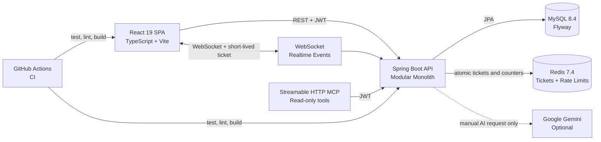

# Billiards Analysis

개인 당구 경기 기록을 데이터로 전환해 통계, 상대 전적, 주간 리포트, AI 코칭 제안까지 제공하는 풀스택 웹 애플리케이션입니다.

단순 기록 저장을 넘어, 인증된 사용자별 데이터 경계를 지키고 반복 가능한 DB 마이그레이션과 자동 검증 파이프라인을 갖춘 서비스 구조를 목표로 구현했습니다.

## Problem And Value

- 경기 결과와 이닝별 점수는 남아 있지만, 실력 변화와 연습 방향을 한눈에 보기 어렵습니다.
- 사용자는 경기 기록을 등록하고, 종목별 통계와 상대 전적을 확인하며, 최근 한 주의 변화를 비교할 수 있습니다.
- 선택적으로 AI 리포트를 생성하면 집계 통계만 사용해 강점, 집중할 점, 연습 제안을 제공합니다.

## Key Features

- Server-managed refresh sessions with hashed token storage, rotation, reuse detection, and HttpOnly cookies

- 회원가입, 로그인, JWT 기반 인증과 프로필 관리
- 3쿠션과 4구 경기 기록 생성, 조회, 수정, 삭제, 검색, 페이지네이션
- 종목별 통계, 평균 추세, 상대 전적, 주간 경기 리포트
- 친구 요청과 친구 관리
- 친구 기반 경기 초대와 수락·거절 상태 관리
- 알림 REST API와 WebSocket 기반 실시간 알림
- 게임방 참가자 전용 WebSocket 기반 참가, 준비, 시작, 취소 이벤트
- 버전 충돌 검사가 적용된 실시간 점수, 이닝, 현재 차례 상태 관리
- 방장 저장 큐와 WebSocket을 이용한 참가자 점수판 실시간 동기화
- 명시적 요청 기반 Gemini 주간 AI 코칭 리포트
- JWT로 보호된 읽기 전용 MCP 경기 분석 도구

## Architecture



### Domain Boundaries

`auth`, `member`, `game`, `friend`, `invitation`, `notification`, `contact`, `ai`, `mcp`를 중심으로 패키지를 나눈 모듈형 모놀리스입니다. 현재는 단일 애플리케이션의 단순성을 유지하면서도, 변경 빈도가 높은 도메인은 독립적으로 확장할 수 있게 경계를 분리했습니다.

## Data Model


## Technical Decisions

### Authentication And Data Isolation

- Access tokens are short-lived API credentials, while refresh tokens are opaque random values stored only in an `HttpOnly`, `SameSite=Strict` cookie.
- The database stores only SHA-256 refresh-token hashes. Every refresh rotates the token, and reuse of an older token revokes its complete login-session family.
- Logout revokes the server-side session before expiring the browser cookie.
- The browser keeps access tokens in memory, restores sessions through the HttpOnly cookie after reload, and never persists access tokens in `localStorage`.
- Concurrent API `401` responses share one refresh request before retrying each original request once.
- WebSocket URLs never contain access tokens. The browser requests a 30-second, single-use ticket before each notification or game-room connection.
- Redis stores only SHA-256 ticket hashes and consumes them atomically, preventing replay and binding game-room tickets to one room.
- Redis Lua scripts enforce shared limits across backend instances: 5 login attempts per account and 30 per address in 5 minutes, 30 WebSocket tickets per minute, and 3 actual AI generations per day.
- Rate-limit identities are SHA-256 hashed, and rejected requests return `429 Too Many Requests` with a browser-readable `Retry-After` header.

- Spring Security와 JWT로 보호 API를 구성했습니다.
- API와 MCP 도구 모두 JWT에서 현재 사용자를 식별합니다.
- 요청에 회원 ID를 받지 않아 다른 사용자의 기록을 조회할 수 없게 했습니다.

### Request Tracing

- Every HTTP response returns `X-Request-Id`, and the same value is written to backend logs.
- A valid request ID from a gateway or client is preserved; malformed or missing values are replaced with a generated UUID.
- The header is exposed through CORS so browser clients can connect an error response to its server-side log entries.

### Transactional Game Completion

- Only the room host can finish an in-progress game, and the request must match the latest scoreboard `stateVersion`.
- Room completion and all participant records are committed in one transaction, so partial record creation cannot remain in the database.
- Each generated record is linked to its source room with a database uniqueness constraint, making finish retries idempotent.
- The `GAME_FINISHED` WebSocket event is published only after the completion transaction commits.
- The host UI flushes its final scoreboard update before requesting completion, while every participant leaves the live board after the committed event arrives.

### Contact Inquiry Privacy

- Public inquiries can be read without signing in, but private inquiries are visible only to their author or an `ADMIN` role.
- Inquiry creation and a member's full inquiry history require JWT authentication.
- Administrator inquiry management returns paginated summaries with optional status filtering, and checks both the JWT role and the current database role.

### Contact Inquiry Answer Notifications

- The first administrator answer publishes an application event, and the owner notification is created only after the inquiry transaction commits.
- An active inquiry owner receives one `SYSTEM` notification through the existing real-time notification flow; answer edits do not create duplicates.

### Error Observability

- Expected business and validation errors are logged at `WARN` without request values or custom exception messages.
- Unexpected errors are logged at `ERROR` with an exception type and source location, not the exception message.

### Database Change Management

- Flyway SQL 마이그레이션으로 테이블, 인덱스, 제약조건 변경 이력을 Git에서 관리합니다.
- Hibernate는 `ddl-auto=validate`로 스키마를 검증만 하므로, 런타임에 의도하지 않은 DDL이 실행되지 않습니다.
- `member_id + played_at` 인덱스와 친구 쌍 유니크 제약조건처럼 조회와 데이터 무결성에 필요한 제약을 DB에 둡니다.

### AI Cost And Privacy Controls

- AI 기능은 기본 비활성화 상태이며, 화면 진입이나 주기 작업만으로 모델을 호출하지 않습니다.
- 사용자가 생성 버튼을 눌렀을 때만 AI 요청을 보냅니다.
- 회원 ID, 이메일, 상대 이름, 메모, 개별 경기 기록은 전송하지 않고 주간 집계 통계만 전달합니다.
- 리포트는 회원, 종목, 기준일 조합으로 저장하고 같은 요청은 캐시를 반환해 중복 호출을 줄입니다.
- Gemini API 키는 백엔드의 로컬 환경 변수에서만 관리하며 React 코드, Docker 빌드 인자, Git에 넣지 않습니다.

### MCP Integration

- Streamable HTTP MCP 서버는 기본 비활성화 상태입니다.
- 활성화해도 JWT 인증이 필요하고, 주간 리포트, 최근 통계, 상대 전적을 조회하는 읽기 전용 도구만 제공합니다.
- MCP 모듈 자체는 LLM 호출을 하지 않으므로 API 키나 모델 비용이 필요하지 않습니다.

### Frontend Performance

- React lazy loading으로 화면별 코드를 분리했습니다.
- React, 애니메이션, 날짜 처리 라이브러리를 공통 청크로 분리해 초기 앱 청크를 약 1.13MB에서 126KB로 줄였습니다.

## Tech Stack

| Area | Technology |
| --- | --- |
| Frontend | React 19, TypeScript, Vite 6, Tailwind CSS 4, React Router, Recharts, Vitest |
| Backend | Java 17, Spring Boot 4, Spring MVC, Spring Data JPA, Spring Security, WebSocket |
| Data | MySQL 8.4, Redis 7.4, H2 for tests, Flyway |
| AI And Protocol | Spring AI, Google Gemini, Streamable HTTP MCP |
| DevOps | Docker Compose, Nginx, GitHub Actions |

## Quality Gates

GitHub Actions runs on every pull request to `main` and every push to `main`.

- Backend: Java 17, Gradle, Spring Boot tests
- Frontend: Vitest API contract tests, TypeScript lint, production build
- Infrastructure: Docker Compose configuration validation
- Full stack: Playwright signup, cookie-based reload restoration, logout, and login E2E against Dockerized MySQL, Redis, backend, and frontend

The E2E job runs only after the backend, frontend, and Compose checks pass. Failed runs upload Playwright traces and screenshots, print Docker logs, and always remove the temporary database volume.

The frontend AI report tests verify the selected game type, explicit `POST` generation request, and error propagation without calling Gemini, a database, or an external API.

## Run Locally

### Docker Compose

From the project root:

```powershell
docker compose up --build
```

| Service | Address |
| --- | --- |
| Frontend | http://localhost:3000 |
| Backend API | http://localhost:8080 |
| Health check | http://localhost:8080/actuator/health |
| Swagger UI | http://localhost:8080/swagger-ui.html |
| OpenAPI JSON | http://localhost:8080/v3/api-docs |
| MySQL host port | localhost:13306 |
| Redis host port | localhost:6379 |

Stop the local stack:

```powershell
docker compose down
```

### Run Each App

Backend requires Java 17 and a local MySQL configuration. See [Backend README](./Backend/README.md) for profiles and database setup.

```powershell
cd Backend
.\gradlew.bat bootRun
```

Frontend:

```powershell
cd Frontend
npm install
npm run dev
```

## Verification Commands

```powershell
cd Backend
.\gradlew.bat test
```

```powershell
cd Frontend
npm run test
npm run lint
npm run build
```

## Project Documents

- [Backend README](./Backend/README.md): profiles, API modules, Flyway, MCP, optional Gemini configuration
- [Frontend README](./Frontend/README.md): frontend environment variables and commands
- [CI workflow](./.github/workflows/ci.yml): automated quality gates

## Current Scope

The project is ready for local Docker-based development and automated CI validation. A production deployment and a real Gemini request are intentionally deferred until a separate budget, provider policy, and operational plan are agreed on.
