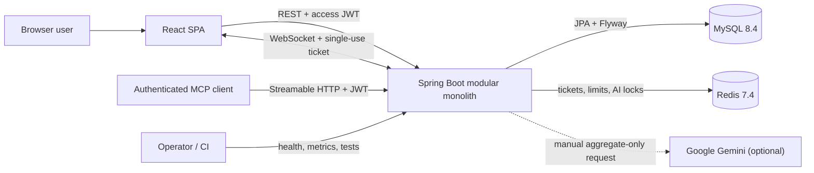
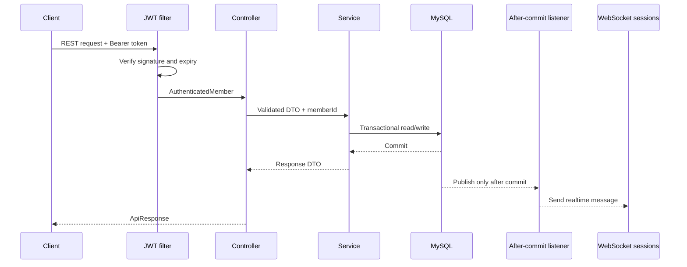

# Billiards Analysis Architecture

## 1. Purpose And Scope

Billiards Analysis는 개인 경기 기록, 통계, 친구·초대, 실시간 게임방, 알림, 선택형 AI 코칭과 MCP 조회 도구를 제공하는 풀스택 애플리케이션입니다.

현재 배포 단위는 React SPA와 Spring Boot 모듈형 모놀리스 한 개입니다. MySQL을 영속 데이터의 기준으로 사용하고 Redis는 만료 가능한 조정 데이터에 사용합니다. 이 문서는 현재 코드로 검증된 구조를 설명하며, 실제 클라우드 배포와 실제 Gemini 호출은 범위에 포함하지 않습니다.

## 2. Quality Goals

| Priority | Goal | Implementation Evidence |
| --- | --- | --- |
| 1 | 회원별 데이터 격리 | JWT principal에서 회원을 식별하고 서비스·쿼리에서 `memberId` 범위를 강제 |
| 2 | 데이터 일관성 | 서비스 트랜잭션, 행 잠금, 상태 버전, DB 유니크 제약조건, Flyway |
| 3 | 안전한 실패 | Redis 보호 기능과 AI 조정 실패 시 우회하지 않고 명시적인 `503` 반환 |
| 4 | 비용 통제 | AI 기본 비활성화, 명시적 사용자 요청만 허용, 캐시·잠금·호출 제한 적용 |
| 5 | 변경 가능성 | 도메인 패키지 경계, 계층 규칙과 모듈 순환 의존성 ArchUnit 검증 |
| 6 | 관측 가능성 | 요청 ID, W3C trace context, Actuator, Micrometer와 제한된 태그 |

## 3. System Context

## 4. Runtime Responsibilities

| Component | Responsibility | State |
| --- | --- | --- |
| React SPA | 화면, 사용자 입력, REST·WebSocket 연결 | 브라우저 메모리와 제한된 세션 상태 |
| Spring Boot | 인증, 권한, 도메인 규칙, 트랜잭션, 실시간 이벤트, MCP | 가능한 한 무상태 |
| MySQL | 회원, 세션 해시, 경기, 게임방, 알림, AI 리포트 | 영속 데이터의 기준 |
| Redis | 일회용 WebSocket 티켓, 분산 요청 제한, AI 생성 잠금 | 만료 가능하고 재생성 가능한 조정 상태 |
| Gemini | 집계 통계를 이용한 선택형 코칭 생성 | 기본 비활성화된 외부 의존성 |
| GitHub Actions | 테스트, 커버리지, 빌드, 보안, 성능, E2E 검증 | PR과 `main` 변경 시 실행 |

## 5. Backend Module Boundaries

| Module | Responsibility | Important Dependencies |
| --- | --- | --- |
| `auth` | 가입, 로그인, access JWT, refresh session rotation | `member`, MySQL |
| `member` | 프로필, 비밀번호, 계정 상태 | `auth` 보안 경계 |
| `game` | 경기 기록·통계, 게임방, 점수 상태와 완료 | `member`, MySQL, WebSocket |
| `friend` | 친구 요청과 관계 | `member`, `notification` |
| `invitation` | 친구 기반 경기 초대와 게임방 참가 | `friend`, `game`, `notification` |
| `notification` | 알림 저장, 읽음 처리, 실시간 전달 | MySQL, WebSocket |
| `contact` | 공개·비공개 문의와 관리자 답변 | `notification` event |
| `notice` | 공개 공지와 관리자 변경 | `member` role |
| `ai` | 주간 집계, 캐시, 생성 조정, 선택형 Gemini 호출 | `game`, MySQL, Redis |
| `mcp` | 인증 회원의 읽기 전용 분석 도구 | `game`, JWT security context |
| `common` | API 응답, 오류, 요청 ID, rate limit, WebSocket ticket, metrics | 공통 인프라 |
| `config`, `security` | profile, CORS, OpenAPI, JWT filter, production validation | 모든 HTTP 진입점 |

각 비즈니스 모듈은 `controller -> service -> domain/repository` 방향을 따릅니다. Controller의 repository 직접 접근, domain의 외부 계층 의존, field injection, 비즈니스 모듈 순환 의존성은 [ArchUnit tests](../Backend/src/test/java/com/my/billiards/architecture/LayerArchitectureTest.java)가 차단합니다.

## 6. Request And Transaction Flow

실시간 이벤트는 가능한 경우 `AFTER_COMMIT`에서 전송합니다. DB 작업이 롤백됐는데 성공 이벤트만 전달되는 상태를 피하기 위한 선택입니다.

## 7. Authentication And Realtime Boundary

1. 로그인은 짧은 수명의 access JWT를 응답하고, refresh token은 `HttpOnly`, `SameSite=Strict` 쿠키에만 저장합니다.
2. 서버는 refresh token 원문 대신 SHA-256 해시, session family, 만료·회전 상태를 MySQL에 저장합니다.
3. Refresh 요청은 행 잠금 안에서 token을 회전합니다. 이미 회전되거나 유효하지 않은 token 재사용은 같은 family를 폐기합니다.
4. WebSocket URL에는 JWT를 넣지 않습니다. 인증된 REST 요청이 30초짜리 목적·게임방 범위의 일회용 ticket을 발급합니다.
5. Redis는 ticket 해시를 원자적으로 소비하므로 같은 ticket의 재사용을 막습니다.

자세한 결정은 [ADR-0002](./adr/0002-jwt-refresh-session.md)와 [ADR-0003](./adr/0003-mysql-redis-state-boundaries.md)에 기록합니다.

## 8. Game Room Consistency

- MySQL의 게임방과 참가자가 권한 및 경기 상태의 기준입니다.
- 방장만 점수 상태를 변경하거나 경기를 완료할 수 있습니다.
- 모든 변경 요청은 클라이언트가 본 `stateVersion`을 전달합니다. 최신 버전과 다르면 `409 ROOM_008`을 반환하고 덮어쓰지 않습니다.
- 쓰기 경로는 `findByIdForUpdate`로 게임방 행을 잠가 동시 변경을 직렬화합니다.
- 경기 완료는 참가자·이닝·점수를 검증하고 참가자별 경기 기록을 하나의 트랜잭션에서 생성합니다.
- `(game_room_id, member_id)` 유니크 제약조건과 완료 상태가 중복 완료 요청의 마지막 방어선입니다.

## 9. AI And MCP Boundary

AI와 MCP는 같은 분석 데이터를 사용하지만 책임과 비용 경계가 다릅니다.

| Capability | AI Report | MCP Tools |
| --- | --- | --- |
| Default | `AI_CHAT_MODEL=none` | `MCP_ENABLED=false` |
| External model call | 사용자가 생성 요청할 때만 선택적으로 호출 | 호출하지 않음 |
| Input | 개인 식별자를 제거한 주간·최근 집계 | JWT 회원의 서버 내부 조회 결과 |
| Cost controls | DB cache, Redis lock, daily rate limit, timeout, circuit breaker, bounded executor | 모델 비용 없음 |
| Access | JWT REST API | JWT Streamable HTTP, read-only tools |

상세 트레이드오프는 [ADR-0004](./adr/0004-ai-mcp-safe-defaults.md)에 기록합니다.

## 10. Data And Schema Ownership

- Flyway SQL이 스키마 변경의 기준이며 JPA는 `ddl-auto=validate`로 일치 여부만 확인합니다.
- 이미 적용된 migration은 수정하지 않고 새 버전 파일을 추가합니다.
- MySQL 시간 저장과 운영 계산은 UTC를 기준으로 하고, 화면 표현에서 지역 시간을 처리합니다.
- Redis 데이터는 TTL과 원자 연산을 사용하며 영속 비즈니스 데이터로 간주하지 않습니다.
- 비밀 값은 환경 변수로만 주입하고 `.env`, key, keystore와 credential 파일은 Git에서 제외합니다.

## 11. Observability And Quality Gates

- 모든 HTTP 응답은 `X-Request-Id`를 반환하며 로그에도 같은 값이 포함됩니다.
- W3C `traceparent`를 이어받고 `traceId`, `spanId`를 로그 상관관계에 사용합니다.
- 공개 health·liveness·readiness와 관리자 전용 metrics·Prometheus endpoint를 분리합니다. 현재 `prod` profile은 `health,info`만 노출하므로 production metric scraping은 별도 보안·운영 결정 전까지 비활성화 상태입니다.
- 메트릭 태그에는 회원 ID, 이메일, 방 ID, 주소, request ID를 넣지 않습니다.
- CI는 backend `check`, JaCoCo, ArchUnit, frontend test·lint·build, secret scan, Compose validation, k6와 Playwright E2E를 실행합니다.
- 현재 JaCoCo 기준은 전체 line 85%, branch 60%이며 측정 baseline은 line 88.03%, branch 67.00%입니다.

## 12. Scaling Boundaries And Known Limitations

현재 구조가 지원하는 범위와 다음 확장 조건을 구분합니다.

- REST 서비스, rate limit, WebSocket ticket, AI lock은 Redis와 MySQL을 공유하면 여러 backend instance에서 일관된 판단이 가능합니다.
- 현재 WebSocket session registry와 realtime sender는 backend process 내부 상태입니다. 여러 instance로 확장하려면 sticky session 또는 Redis Pub/Sub·전용 message broker를 추가해야 instance 간 broadcast가 보장됩니다.
- 단일 MySQL이 영속 데이터의 기준이므로 읽기 부하가 커지면 query·index 측정 후 read replica 또는 cache를 검토합니다.
- CI의 H2 테스트는 빠른 회귀 검증용이며 MySQL 차이는 Docker 기반 full-stack E2E와 Flyway 실행으로 보완합니다.
- 실제 cloud 배포, backup 복원 훈련, 외부 collector, 실제 Gemini 호출은 아직 검증하지 않았습니다. 이를 완료하기 전에는 production 운영 완료로 표현하지 않습니다.
- 모듈 경계는 유지하지만 현재 규모에서는 microservice 분리의 네트워크·배포 복잡성을 도입하지 않습니다.

## 13. Decision And Code Traceability

- [ADR-0001: Modular Monolith](./adr/0001-modular-monolith.md)
- [ADR-0002: JWT And Refresh Sessions](./adr/0002-jwt-refresh-session.md)
- [ADR-0003: MySQL And Redis State Boundaries](./adr/0003-mysql-redis-state-boundaries.md)
- [ADR-0004: AI And MCP Safe Defaults](./adr/0004-ai-mcp-safe-defaults.md)
- [Security configuration](../Backend/src/main/java/com/my/billiards/security/SecurityConfig.java)
- [Refresh session service](../Backend/src/main/java/com/my/billiards/auth/service/RefreshTokenService.java)
- [Game room service](../Backend/src/main/java/com/my/billiards/game/service/GameRoomService.java)
- [AI report service](../Backend/src/main/java/com/my/billiards/ai/service/AiWeeklyReportService.java)
- [MCP tools](../Backend/src/main/java/com/my/billiards/mcp/BilliardsReportMcpTools.java)
- [CI workflow](../.github/workflows/ci.yml)
